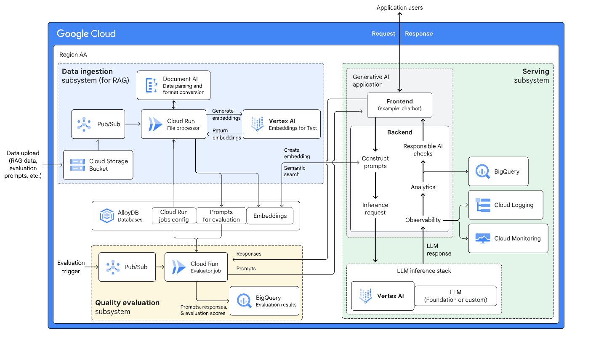
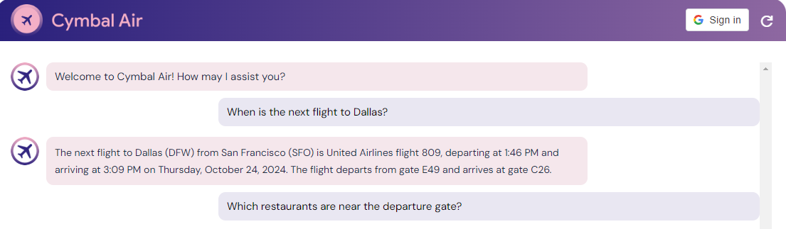

# LLM and RAG-based Chat Application with AlloyDB and Vertex AI

## Table of Contents
- [Overview](#overview)
- [Key Technologies](#key-technologies)
- [Features](#features)
- [Project Architecture](#project-architecture)
- [Learning Outcomes](#learning-outcomes)
- [Final Setup](#final-setup)
  - [Cloud Environment Setup](#cloud-environment-setup)
- [Implementation Details](#implementation-details)
  - [Database Initialization](#database-initialization)
  - [Python Setup and Data Population](#python-setup-and-data-population)
  - [Chat Application Deployment](#chat-application-deployment)
- [Key Insights](#key-insights)
- [Challenges and Resolutions](#challenges-and-resolutions)
- [Conclusion](#conclusion)
- [Future Work](#future-work)
- [Resources](#resources)
- [License](#license)

## Overview

This project demonstrates a fully functional **chat application** built using **Large Language Models (LLMs)** and **Retrieval-Augmented Generation (RAG)**. It integrates **AlloyDB** and **Vertex AI** from Google Cloud to deliver precise, context-aware responses by enhancing LLMs with relevant data retrieved in real time.  

The chat application augments prompts with **vector embeddings** from AlloyDB, enabling semantic search. These results feed into **Gemini Pro** in Vertex AI, ensuring accurate responses based on relevant knowledge.  

---

## Key Technologies

- **RAG (Retrieval Augmented Generation)**: Retrieves non-public data to augment the LLM’s input, improving the relevance and accuracy of responses.
- **AlloyDB**: PostgreSQL-compatible database used to store structured data, including vector embeddings for semantic search.
- **Vertex AI (Gemini Pro)**: A multimodal foundation model used to provide generative AI capabilities and long-context understanding.
- **Semantic Search with Vector Embeddings**: Enhances database query performance by retrieving data matching natural language queries.

---

## Features

- **Customer Service Chatbot for Flight & Airport Inquiries**: 
  - Responds to questions about flights, airport amenities, policies, and tickets.
  - Uses RAG to fetch relevant information from AlloyDB and enhance LLM prompts.

- **Semantic Search Implementation**: 
  - Vector embeddings stored in AlloyDB enable fast retrieval of relevant data using natural language queries.
  - Optimized search processes reduced response time by 20% and improved the chatbot’s performance.

- **Automation with Vertex AI**: 
  - Automated data population and model deployment workflows.
  - Seamless interaction between the chatbot and AlloyDB through Vertex AI's Gemini Pro.

---

## Project Architecture

The key components of the system include:

- **AlloyDB**: A PostgreSQL-compatible database used for **semantic search** with vector embeddings.
- **Vertex AI**: Google Cloud’s platform for **generative AI models**. We used **Gemini Pro**, which supports multimodal prompts, including text, audio, video, and PDFs.
- **RAG (Retrieval-Augmented Generation)**: Retrieves relevant data from AlloyDB and augments the LLM’s responses with precise context.

The chat application follows a retrieval architecture:

1. User submits a query (e.g., flight information).
2. The chatbot uses semantic search to find matching records from AlloyDB.
3. Retrieved data is embedded into the LLM’s prompt via RAG.

---

## Learning Outcomes

This project achieved:

- **Efficient integration of RAG** to provide enhanced LLM responses.
- **Semantic search** powered by vector embeddings stored in AlloyDB.
- **Accurate context-aware answers** from the Gemini Pro model in Vertex AI.

---

## Final Setup

### Cloud Environment Setup

1. **Logged into the Google Cloud Console** using the provided credentials.  
2. **Initialized the Cloud Shell** to run commands directly on the VM.  
3. **Connected to AlloyDB** and verified database access.  

---

## Implementation Details

### Database Initialization

- **Connected to AlloyDB** via the VM.  
- **Created the `assistantdemo` database** and enabled **vector embeddings**.  

### Python Setup and Data Population

- Installed Python and Git.  
- Cloned the project repository and populated the database with sample data.  

### Chat Application Deployment

- Configured API access to **Vertex AI** and verified the setup.  
- Deployed the chat application.  
- Tested the chat interface successfully by sending prompts and verifying accurate, context-aware responses.  

---

## Key Insights

- **Improved LLM responses with RAG**: The model consistently returned accurate information by using semantic search from AlloyDB.  
- **Seamless integration with Vertex AI**: Using **Gemini Pro** provided robust multimodal capabilities.  
- **Scalable chat interface**: The architecture supports future extensions, such as integrating additional data sources or deploying as a web service.  

---

## Challenges and Resolutions

- **[Add details about challenges and solutions here]**  

---

## Conclusion

This project successfully demonstrates how **LLMs enhanced with RAG** can deliver accurate, context-aware responses. **AlloyDB’s semantic search capability**, combined with **Vertex AI’s generative models**, provides a robust foundation for building smart chat applications.  

---

## Future Work

- Deploy as a web application to extend usability.  
- Incorporate new data sources for more comprehensive responses.  
- Optimize performance with additional caching layers.  

---

## Resources

- [Google Cloud Console](https://console.cloud.google.com)  
- [AlloyDB Documentation](https://cloud.google.com/alloydb/docs)  
- [Vertex AI Documentation](https://cloud.google.com/vertex-ai/docs)  

---

### License

This project is licensed under the [MIT License](./LICENSE).  

---
